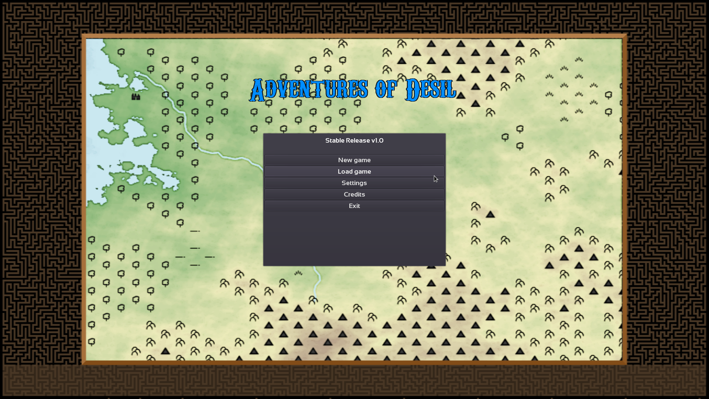
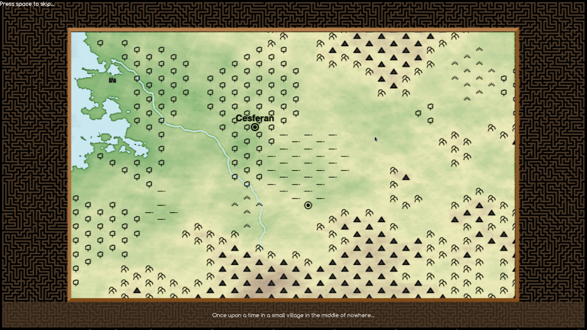
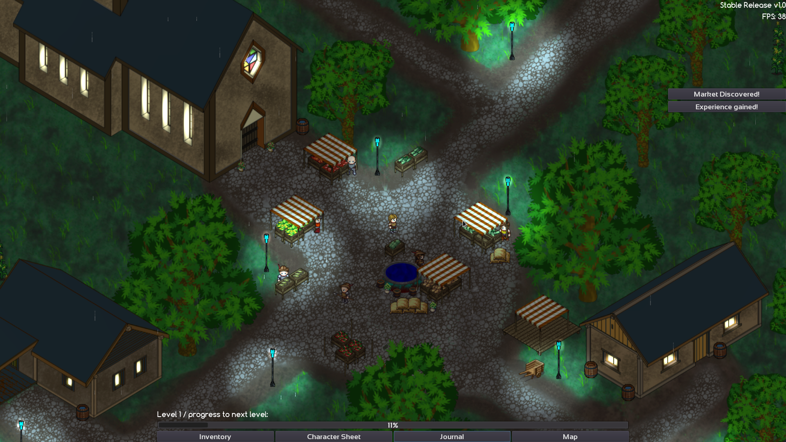
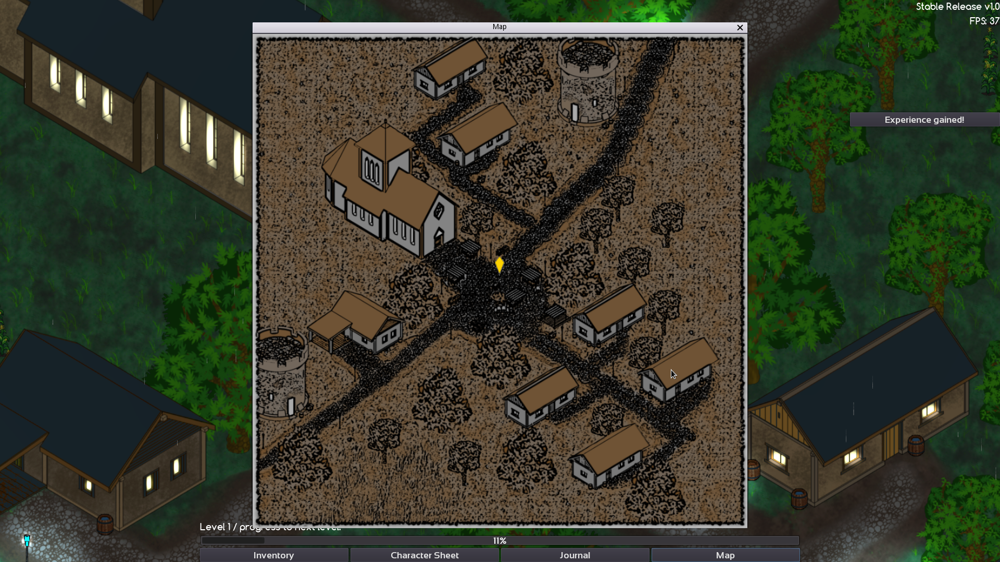
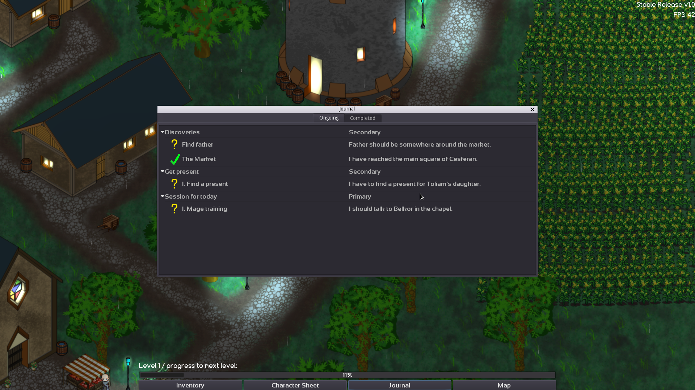
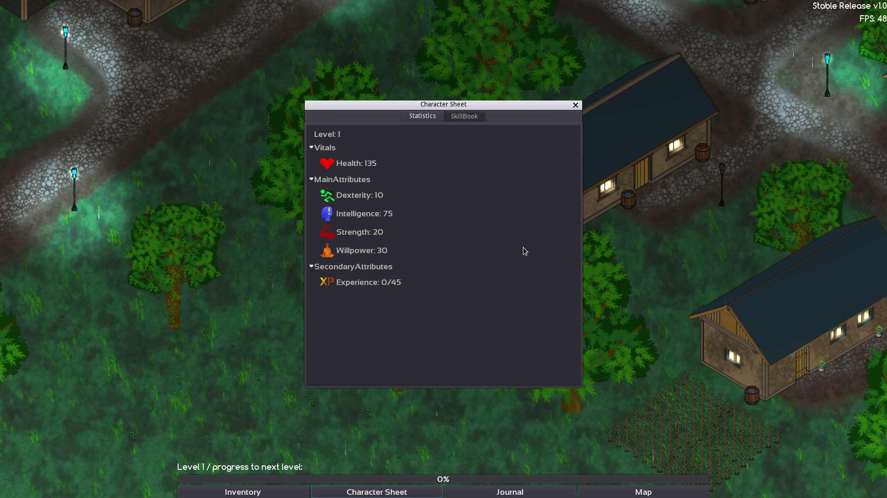
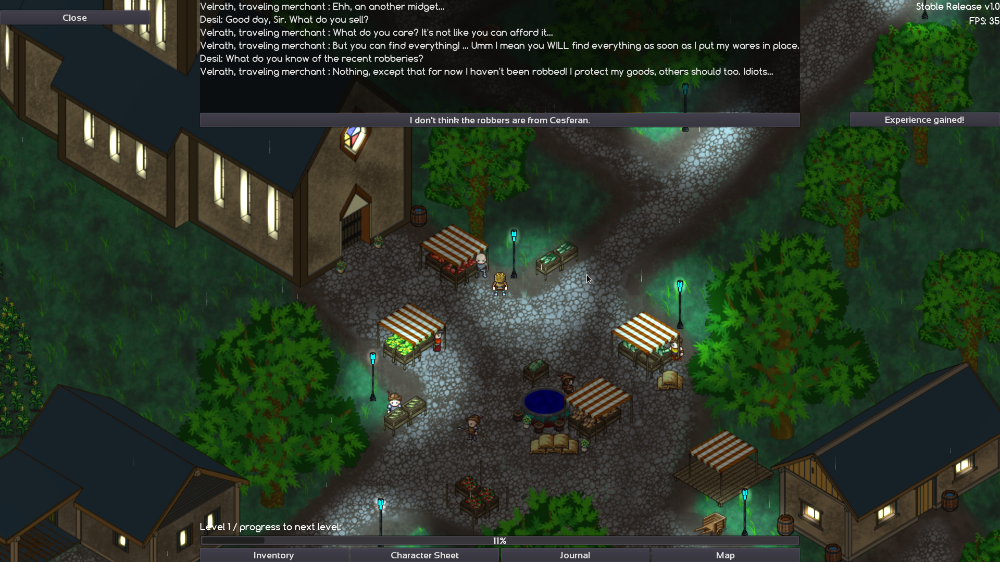
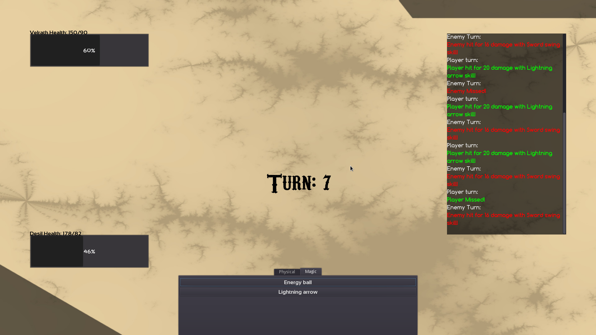

# :video_game: Adventures of Desil ( 2D RPG ) :video_game:

This was my thesis work at Eötvös Loránd University in 2017.
This game is a 2D RPG, where you take the role of a young hero named Desil, who aspires to be a great hero.
However, as in every good story, first he has to master the art of magic and combat. 
The goal of the game is to get to the end of the main questline, while gathering experience points and becoming stronger.

The game is a cross-platform ( Windows and Linux ) x64 application. Supports multiple resolutions and graphics settings.
The game was built with the Godot(v2.1) engine. The main gameplay systems were written with GD-Script.
Additionally, I used my own C++ framework for handling the character attributes and items. You can find the project on my [GitHub](https://github.com/tiarise/reikon-framework) also!
Since the two languages could not communicate directly, I've created a custom C++ module, that I compiled into the engine. This 
created a "bridge" between the two systems.

## :joystick: Try it out :joystick:

I've added the [Binaries.7z](https://github.com/tiarise/thesis/blob/main/Binaries.7z) prebuilt for Windows and Linux.
The game supports 800x600, 1366x768, 1920x1080 resolutions.

## :camera_flash: Ingame pictures :camera_flash:

#### Menu

#### Loading Screen

#### Ingame in the town

#### Map window

#### Quest window

#### Attributes window

#### Dialog window

#### Battle window

